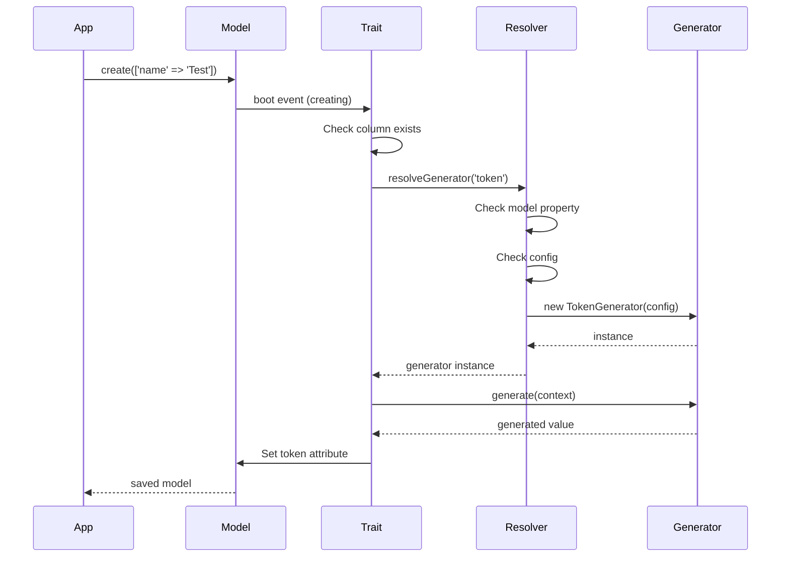

# Architecture Overview

Traitify is built on a flexible, modular architecture that separates concerns and provides multiple extension points.

## Core Components

```
┌─────────────────────────────────────────────────────┐
│                   Your Models                        │
│            use InteractsWithToken, etc.             │
└──────────────────┬──────────────────────────────────┘
                   │
┌──────────────────▼──────────────────────────────────┐
│              Trait Layer                             │
│  ┌────────────────────────────────────────────────┐ │
│  │ InteractsWithToken                             │ │
│  │ InteractsWithUuid                              │ │
│  │ InteractsWithSlug                              │ │
│  └──────────────────┬─────────────────────────────┘ │
└─────────────────────┼───────────────────────────────┘
                      │
┌─────────────────────▼───────────────────────────────┐
│         HasGeneratorResolver                         │
│     (Resolution Logic: Model → Config → Default)    │
└──────────────────┬──────────────────────────────────┘
                   │
┌──────────────────▼──────────────────────────────────┐
│            Generator Layer                           │
│  ┌────────────────────────────────────────────────┐ │
│  │ ValueGenerator (Interface)                     │ │
│  ├────────────────────────────────────────────────┤ │
│  │ AbstractValueGenerator                         │ │
│  ├────────────────────────────────────────────────┤ │
│  │ TokenGenerator │ UuidGenerator │ SlugGenerator │ │
│  └────────────────────────────────────────────────┘ │
└──────────────────────────────────────────────────────┘
```

## Layer Responsibilities

### 1. Model Layer (Your Application)

- Uses traits to add functionality
- Optionally customizes generators via properties
- Defines column names and behaviors

### 2. Trait Layer (Package)

- Hooks into Eloquent lifecycle events
- Checks schema for column existence
- Delegates generation to resolvers
- Provides query scopes

### 3. Resolver Layer (Package)

- Implements three-tier resolution strategy
- Instantiates appropriate generators
- Passes context to generators

### 4. Generator Layer (Package + Your Custom)

- Implements ValueGenerator interface
- Generates values based on configuration
- Validates generated values
- Supports customization via config arrays

## Design Patterns

### Strategy Pattern

Generators implement the Strategy pattern, allowing different generation algorithms to be swapped at runtime.

```php
// Default strategy
$model->tokenGenerator = TokenGenerator::class;

// Custom strategy
$model->tokenGenerator = MyCustomGenerator::class;
```

### Template Method Pattern

AbstractValueGenerator uses the Template Method pattern:

```php
abstract class AbstractValueGenerator
{
    // Template method
    public function __construct(array $config = [])
    {
        $this->config = array_merge(
            $this->getDefaultConfig(), // Hook method
            $config
        );
    }

    abstract protected function getDefaultConfig(): array;
}
```

### Dependency Injection

Generators receive configuration through constructor injection:

```php
$generator = new TokenGenerator([
    'length' => 64,
    'prefix' => 'API_',
]);
```

## Resolution Hierarchy

The package uses a three-tier resolution strategy to determine which generator to use:

```
1. Model Property
   ↓ (if not defined)
2. Configuration File
   ↓ (if not defined)
3. Default Generator
```

### Example Flow

```php
// Model definition
class ApiKey extends Model
{
    use InteractsWithToken;

    protected $tokenGenerator = CustomGenerator::class;
}

// Resolution process:
1. Check $tokenGenerator property → Found! Use CustomGenerator
   (Skip steps 2 and 3)

// Alternative flow (no property):
1. Check $tokenGenerator property → Not found
2. Check config('traitify.generators.token') → Found! Use configured generator
   (Skip step 3)

// Alternative flow (no property or config):
1. Check $tokenGenerator property → Not found
2. Check config('traitify.generators.token') → Not found
3. Use default TokenGenerator::class
```

## Extension Points

### 1. Custom Generators

Create new generator classes by extending AbstractValueGenerator:

```php
class MyGenerator extends AbstractValueGenerator
{
    protected function getDefaultConfig(): array { }
    public function generate(array $context = []): mixed { }
    public function validate(mixed $value, array $context = []): bool { }
}
```

### 2. Configuration Override

Override defaults in `config/traitify.php`:

```php
'generators' => [
    'token' => [
        'class' => MyTokenGenerator::class,
        'config' => ['custom' => 'value'],
    ],
],
```

### 3. Per-Model Customization

Customize behavior per model:

```php
class ApiKey extends Model
{
    protected $tokenGenerator = CustomGenerator::class;
    protected $tokenGeneratorConfig = ['length' => 32];
}
```

## Component Interactions

### Creating a Model with Generated Values



## Key Design Decisions

### 1. Trait-Based Architecture

**Why**: Laravel developers are familiar with traits. They provide a clean way to add functionality without inheritance.

### 2. Boot Lifecycle Hooks

**Why**: Automatic generation feels natural and requires zero boilerplate in controllers.

### 3. Configuration Hierarchy

**Why**: Flexibility - App-wide defaults with per-model overrides when needed.

### 4. Schema Awareness

**Why**: Safety - Won't break if column doesn't exist. Allows gradual adoption.

### 5. Non-Destructive

**Why**: Respects manual values. Only generates when column is null/empty.

## Next Steps

- [Generator Pattern](02-generator-pattern.md) - Deep dive into generators
- [Resolution Strategy](03-resolution-strategy.md) - How generators are resolved
- [Extension Guide](../07-advanced/README.md) - Create custom generators
